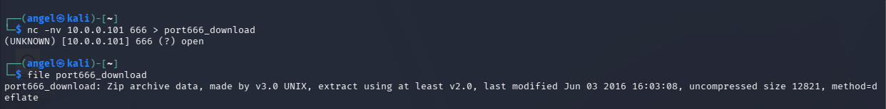
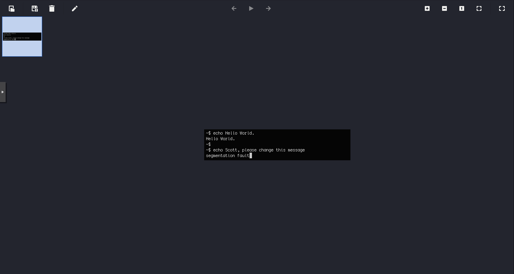
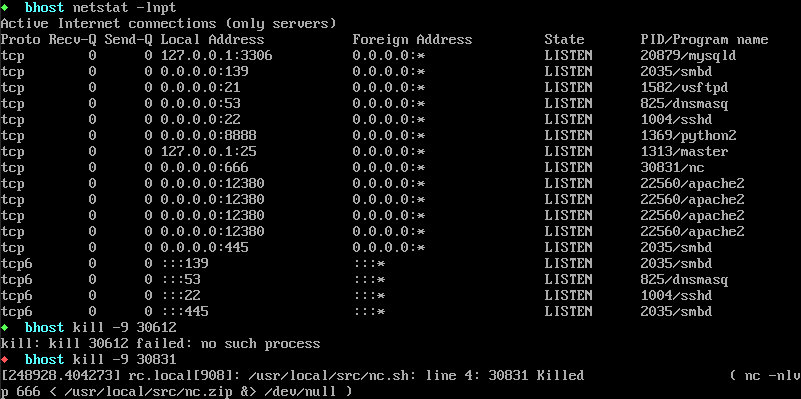
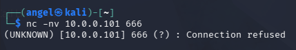
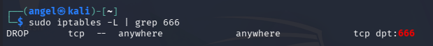
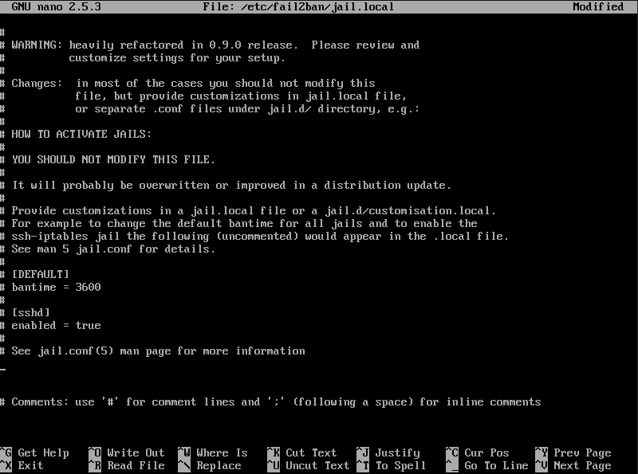
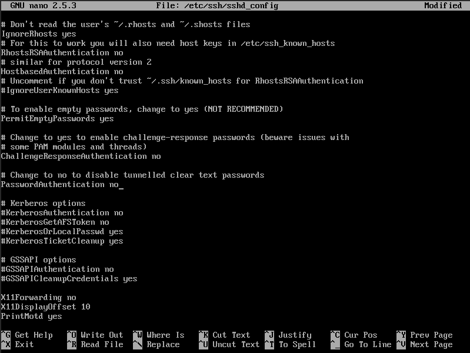
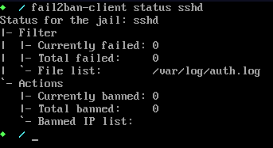
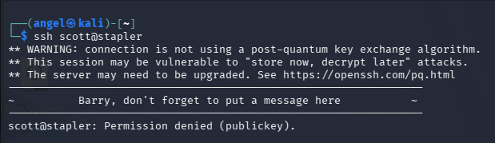

## Port 21 - FTP

Nmap revealed that the FTP service was allowing anonymous logins, meaning that threat actors could connect to the server and read or modify files without any credential validation.

**Discovery**: Connected to the server via terminal to confirm that anonymous logins were permitted.

**Solution**: 

* **Access Control**: Edited `/etc/vsftpd.conf`, changed `anonymous_enable=YES` to `anonymous_enable=NO`, and restarted the service to enforce the new configuration.

**Validation**: 

Attempted to connect to the server via the terminal again, this time receiving an `Error 530: Permission denied`, showcasing that the vulnerability was successfully patched.

## Port 139 - SMB

Enumeration of SMB revealed that network shares were misconfigured to allow guest access.

**Discovery**: Once connected to the SMB server, I was able to navigate and view files inside two different directories without requiring any credential validation.

**Solution**: 

* **Access Control**: Edited `/etc/samba/smb.conf`, changed `guest ok = yes` to `guest ok = no`, and restarted the service.

**Validation**: 

Attempted to view the contents of the same directories as an unauthenticated user and received an `NT_STATUS_ACCESS_DENIED` error.

## Port 3306 - MySQL

Enumeration revealed that the MySQL database was misconfigured to listen on all network interfaces (`0.0.0.0`), exposing it to external routing and brute-force attacks.

**Discovery**: Attempted to connect to the MySQL database from an external machine. Received the error `Access denied for user 'root'@'10.0.0.100'`, confirming the database was actively listening to external traffic instead of dropping it.

**Solution**: 

* **Network Binding**: Edited the `/etc/mysql/mysql.conf.d/mysqld.cnf` configuration file to enforce segmentation by changing `bind-address = 0.0.0.0` to `bind-address = 127.0.0.1`, and restarted the service.

**Validation**: 

Attempted to connect to the database from the external machine again and received a `Can't connect to server` error, confirming the MySQL database is now ignoring external requests and is now bound to localhost.

## Port 80 and 12380 - Web Applications (HTTP & HTTPS)

Enumeration of the HTTP port revealed that the web server was incorrectly set up on a private home directory instead of a secure web folder (`/var/www/html/`).

Enumeration of the HTTPS port revealed an intentionally obscured administrative structure and a outdated Content Management System (CMS).

**Discovery**: Executed a directory brute-force scan (`dirb https://stapler:12380`) which revealed a hidden `/phpmyadmin/` portal. Manual review of the `robots.txt` file uncovered additional obscured directories, including `/blogblog/` and `/admin112233/`. 

Source code analysis of the `/blogblog/` directory leaked the exact CMS version via a meta tag (`<meta name="generator" content="WordPress 4.2.1" />`). WordPress 4.2.1 is highly vulnerable to multiple known CVEs.

**Solution**: 

* **Patch Management**: Upgrade WordPress core, themes, and plugins to the latest stable releases to neutralize known CVEs.

* **Process Termination**: Identified the PID of the rogue PHP service running on Port 80 and terminated it to close the exposed home directory.

* **Access Control**: Restricted access to the `/phpmyadmin/` and `/wp-admin/` endpoints using IP whitelisting via `.htaccess` and Apache configurations.

* **Information Hiding**: Injected a PHP function into the active WordPress theme to remove the `<meta name="generator">` tag.

**Validation**:

* Attempted to navigate to the exposed `.bashrc` file on Port 80; the connection timed out.

* Attempted to access both the `/phpmyadmin/` and `/blogblog/wp-admin/` directories from an unauthorized IP; received Apache 403 Forbidden errors.

* Reviewed the source HTML of the WordPress blog; verified the generator meta tag is no shown.

## Port 666 - Unknown Service

An initial Nmap scan revealed an unidentified service running on Port 666. 

**Discovery**: Executed a banner grabbing technique using Netcat (`nc -nv 10.0.0.101 666`). Redirected the output to a file and utilized the Linux `file` command to identify it as a ZIP archive. Upon extraction, a hidden image (`message2.jpg`) was discovered containing a terminal screenshot that leaked a valid internal username: "Scott".

**Solution**:

* **Process Termination**: Identified the rogue process running on Port 666 using `netstat -lnpt` and terminated it.

* **Network Segmentation**: Updated the firewall rules (`iptables`) to explicitly drop all inbound TCP traffic on Port 666 to prevent the backdoor from being reached if it restarts.

**Validation**:

Verified the `iptables` configuration to ensure the DROP rule was successful.

## Port 22 - SSH

With system enumeration complete, a targeted list of valid system users was compiled from various misconfigured services across the network: `kathy` (SMB), `admin` (WordPress), `john` (WordPress), and `scott` (Port 666).

**Discovery**: The SSH service on Port 22 was exposed and accepting password-based authentication. Because a targeted list of internal usernames was successfully enumerated, this service was highly vulnerable to a brute-force attack against those accounts.

**Solution**:

* **Rate Limiting & Account Lockouts**: Installed and configured `fail2ban` to monitor SSH logs and automatically ban IP addresses that exceed a threshold of failed login attempts.

* **Key-Based Authentication**: Edited the `/etc/ssh/sshd_config` file to disable password authentication entirely (`PasswordAuthentication no`). Enforced public key authentication for all users.

**Validation**: 

Verified the `fail2ban` SSH jail was active and actively monitoring the authentication logs.

Attempted to connect to the SSH service using a valid username (`scott`). Received an immediate `Permission denied (publickey)` error without a password prompt.

