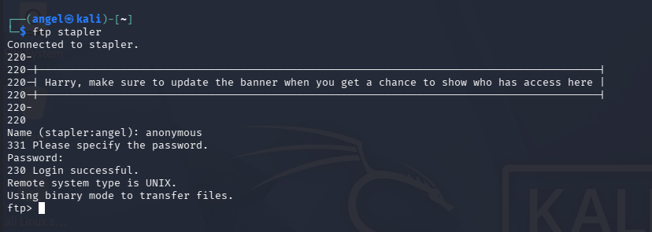
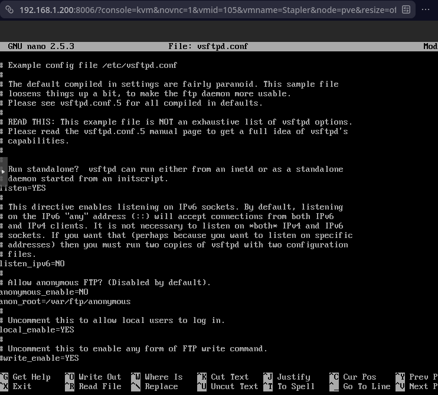
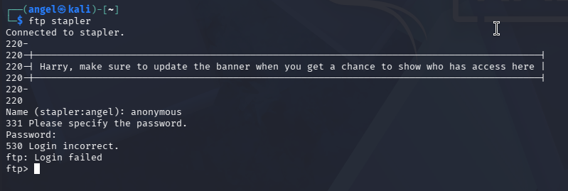
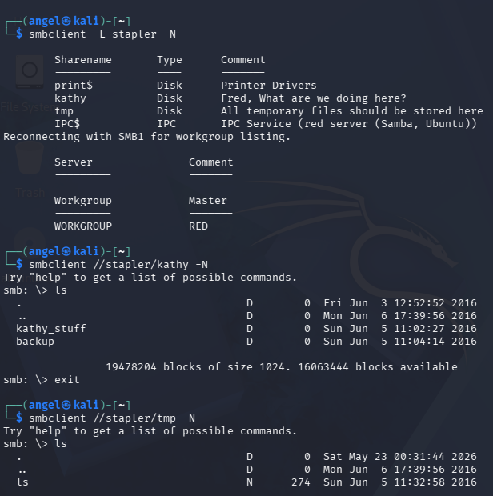
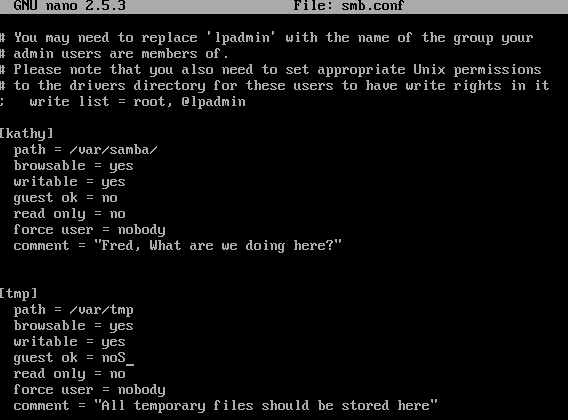
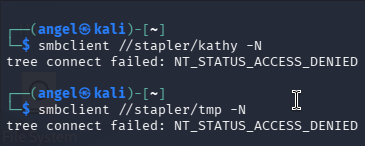

## Port 21 - FTP
Nmap revealed that the FTP service was allowing anonymous logins, meaning that threat actors could connect to the server and read or modify files without any credential validation.
**Exploit**: Connected to the server via terminal to confirm that anonymous logins were possible.

**Solution**: Edited /etc/vsftpd.conf, changed "anonymous_enable=YES" to "anonymous_enable=NO", and then restarted service.

**Validation**: Attempted to connect to the server via the terminal again, this time receiving error 530, showcasing that the vulnerability was patched.

## Port 139 - SMB
Enumeration of SMB revealed that network shares were misconfigured to allow guest access.
**Exploit**: Once connected to the SMB server, I was able to look at files inside two different directories without any credential validation.

**Solution**: Edited /etc/samba/smb.conf, changed "guest ok = yes" to "guest ok = no", and then restarted service.

**Validation**: Attempted to look inside the same directories, and I received a denial error.

