## Port 21 - FTP

Nmap revealed that the FTP service was allowing anonymous logins, meaning that threat actors could connect to the server and read or modify files without any credential validation.

**Exploit**: Connected to the server via terminal to confirm that anonymous logins were possible.

**Solution**: Edited /etc/vsftpd.conf, changed "anonymous_enable=YES" to "anonymous_enable=NO", and then restarted service.

**Validation**: Attempted to connect to the server via the terminal again, this time receiving error 530, showcasing that the vulnerability was patched.

## Port 139 - SMB

Enumeration of SMB revealed that network shares were misconfigured to allow guest access.

**Exploit**: Once connected to the SMB server, I was able to look at files inside two different directories without any credential validation.

**Solution**: Edited /etc/samba/smb.conf, changed "guest ok = yes" to "guest ok = no", and then restarted service.

**Validation**: Attempted to look inside the same directories, and I received a denial error.

## Port 3306 - MySQL

Enumeration revealed that the MySQL database was misconfigured to listen on all network interfaces (0.0.0.0), exposing it to external routing.

**Exploit**: Attempted to connect to the MySQL database. Received error "Access denied for user 'root'@'10.0.0.100'" confirming it was listening to external traffic instead of dropping them.

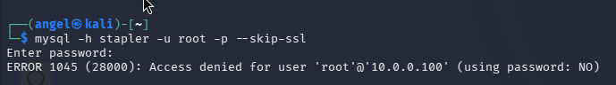

**Solution**: Edited the `mysqld.cnf` configuration file to enforce segmentation by changing "bind-address = 0.0.0.0" to "bind-address = 127.0.0.1" and then restarted service.

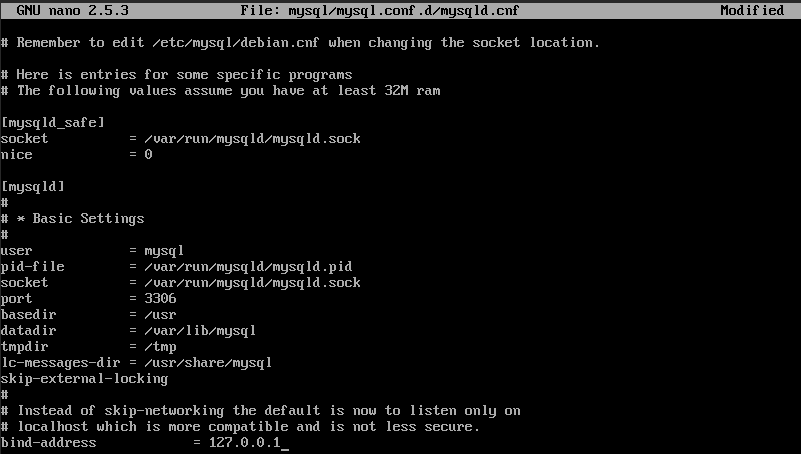

**Validation**: Attempted to connect to the database again and received error "Can't connect to server..." error, confirming the MySQL database is now ignoring external requests and strictly bound to localhost.

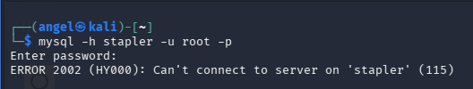

## Port 80 and 12380 - Web Applications (HTTP & HTTPS)

Enumeration of the HTTP port revealed that the web server was incorrectly set up on a private home directory instead of a secure web folder (`/var/www/html/`).

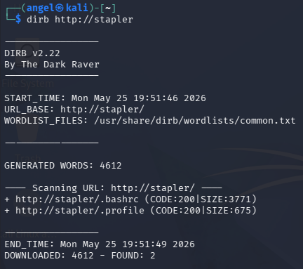

Enumeration of the non-standard HTTPS port revealed an intentionally obscured administrative structure and a critically outdated Content Management System (CMS).

**Discovery**: Executed a directory brute-force scan (`dirb https://stapler:12380`) which revealed a hidden `/phpmyadmin/` portal. Manual review of the `robots.txt` file uncovered additional obscured directories, including `/blogblog/` and `/admin112233/`. 

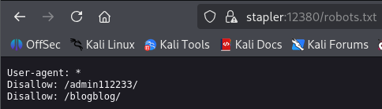

Source code analysis of the `/blogblog/` directory leaked the exact CMS version via a meta tag (`<meta name="generator" content="WordPress 4.2.1" />`). WordPress 4.2.1 is highly vulnerable to multiple known CVEs.

**Solution**: 

* **Patch Management**: Upgrade WordPress core, themes, and plugins to the latest stable releases to neutralize known CVEs.

* **Kill Temporary Server**: Find PID of PHP program, and kill it.

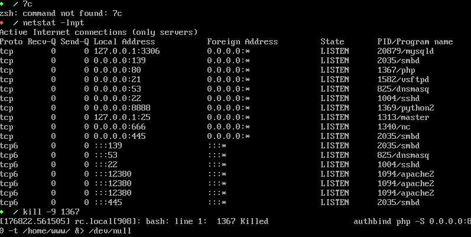

* **Access Control**: Restrict access to the `/phpmyadmin/` and `/wp-admin/` endpoints using IP whitelisting so they are not exposed to the public internet.

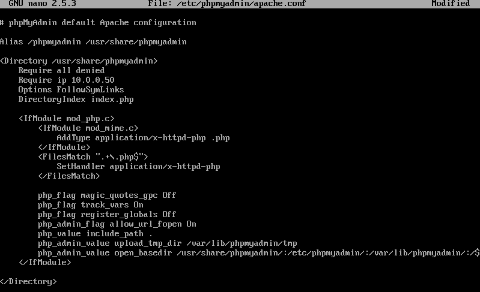

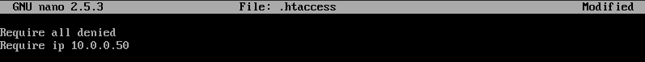

* **Information Hiding**: Remove the `<meta name="generator">` tag from the WordPress header to prevent passive version fingerprinting.

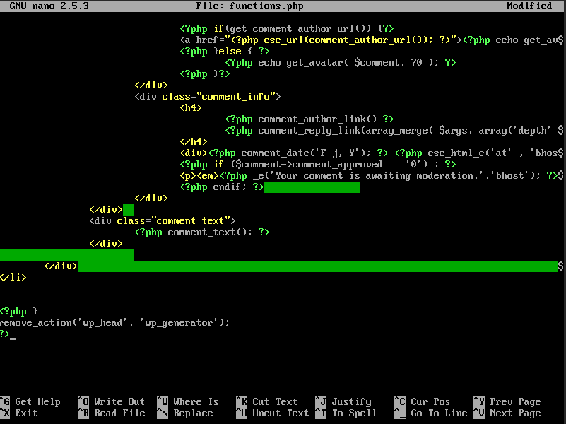

**Validation**:

* Attempted to navigate to the exposed `.bashrc` file on Port 80; the connection timed out, confirming the rogue server is offline.

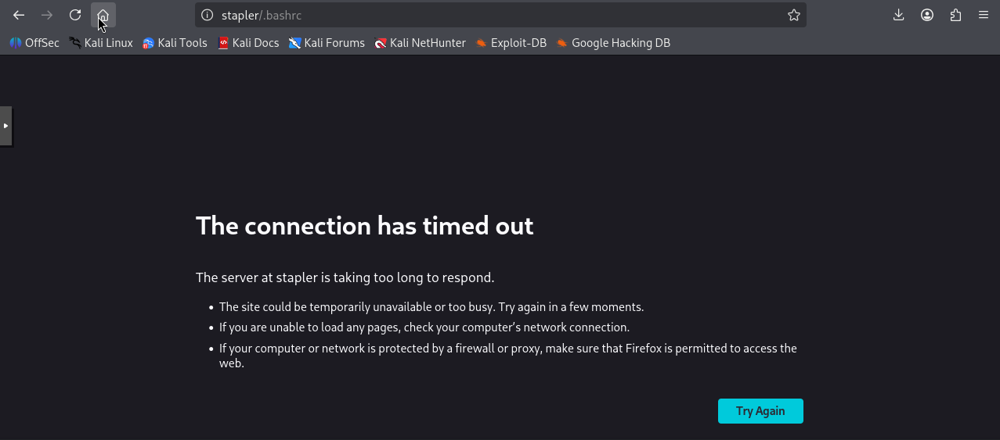

* Attempted to access both the `/phpmyadmin/` and `/blogblog/wp-admin/` directories from an unauthorized IP; received Apache 403 Forbidden errors, confirming the access control lists are functional.

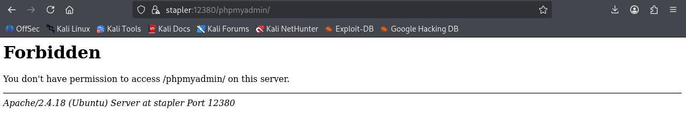

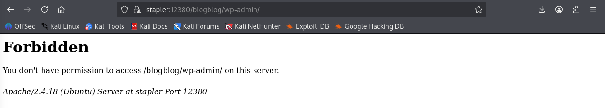

* Reviewed the source HTML of the WordPress blog; verified the generator meta tag is no longer broadcasted.

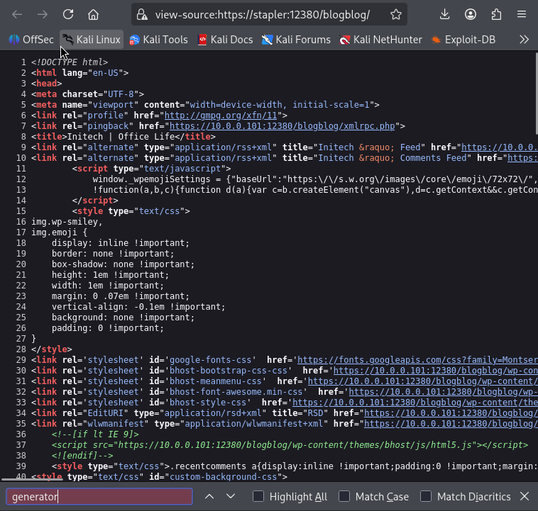

